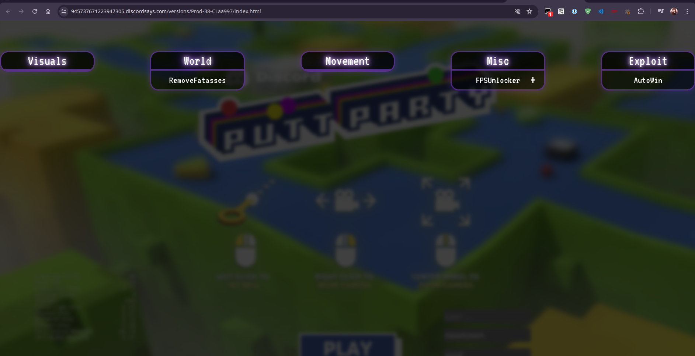
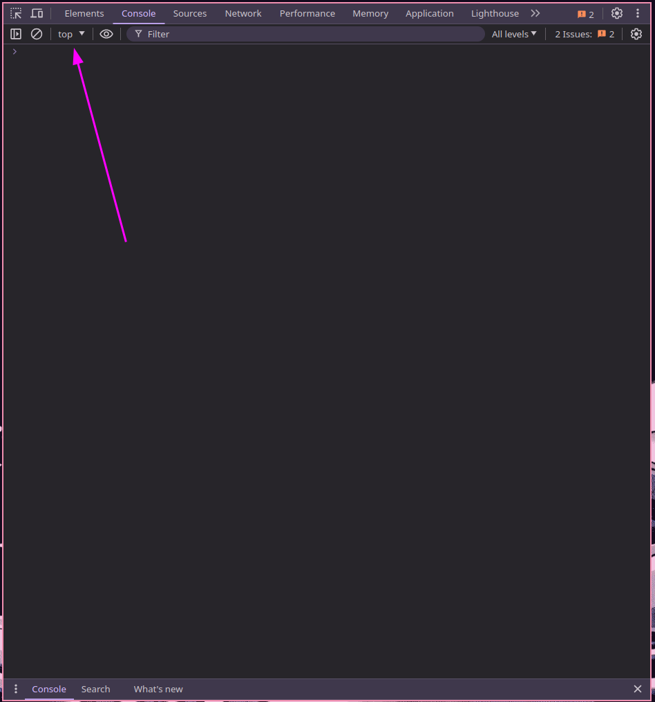
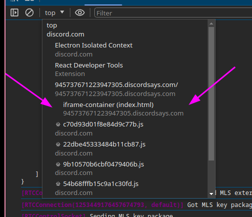

# Prerequisites

- [Bun](https://bun.sh/)
- [Tampermonkey](https://www.tampermonkey.net/)

# Installation

### Step 1

Clone the repository

```bash
git clone https://github.com/zastlx/elficia.git
```

### Step 2

Install the dependencies

```bash
cd elficia
bun install
```

### Step 3

If you are going to work in a development environment, you can run the following command to recompile the code whenever you make changes.

```bash
bun watch
```

If not you can run the following command to compile the code once.

```bash
# Hint: you cant use 'bun build' because that is a built in bun command and will not work
bun run build
```

### Step 4

Take the file `assets/puttpartyfix.user.js` and create a new Tampermonkey script with the contents of the file.

### Step 5

Run the following command in the root of the project to start the server.

```bash
bunx serve . -p 5050
```

### Step 6

Go to the [browser link](https://945737671223947305.discordsays.com/versions/Prod-38-CLaa997/index.html) of putt party and you should see a button that says "Start" click it and you should see the game start, after you see the home screen of the game, you should click the "Elficia" button in the top left corner of the screen, after that you can click the right shift key to open Elficia's clickgui.


### Step 7

You now have Elficia running on your browser, after you make changes to the code you can refresh the page and repeat step 6 to see the changes. You can now start modding the game, I may make a more in depth guide in the future but for now you can take a look at Elficia's code and see how it works. Another tip, look at `cc.director.getScene()`. I also have various global variables defined by elficia for ease of access in development.

```mk
mm - The module manager
gm - The GUI manager for elficia
gnm - A function that returns the network manager for Putt Party, (api/Net.ts)
km - The keybind manager for elficia
spitroast - the function patcher (https://github.com/Cumcord/spitroast)
```

# Running in Discord

### Step 1

Copy the output from `dist/elficia.js`

### Step 2

Open your Discord client and start the Putt Party activity

### Step 3

Open the developer console with `Ctrl + Shift + I`

### Step 4

Click on the dropdown in the top left corner of the console, it should say `top`


### Step 5

Chose the dropdown that says `iframe-container (index.html)`




### Step 6

Paste the code you copied from `dist/elficia.js` into the console and press enter

### Step 7

Press the right shift key to open Elficia's clickgui and everything should work as expected

# Credits

- [allie](https://github.com/microcrit)
- [Xotic](https://github.com/XOTlC)
- [spitroast](https://github.com/Cumcord/spitroast)